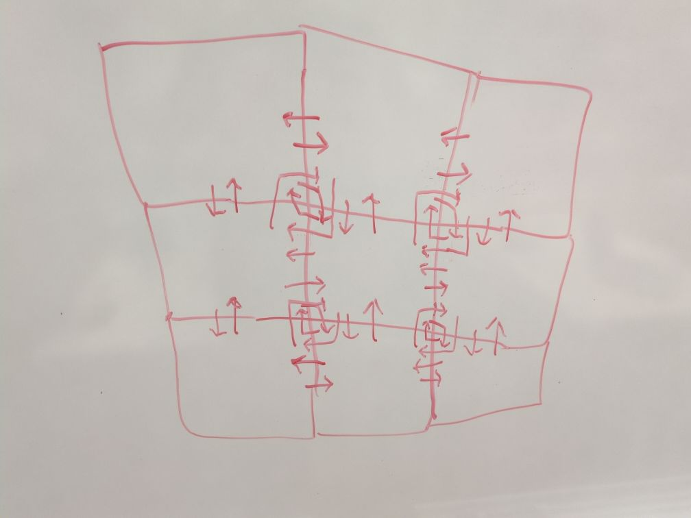

# ConwayHW
- A hardware implementation of Conway's Game Of Life

To use the `.circ` files, you'll need [Logisim Evolution](https://github.com/logisim-evolution/logisim-evolution).
The main Logisim file is at `Logic/Conway.circ`. The last commit containing the old `Logic/Conway-no_autoset.circ` is `22831e2f332a921313080eab156c4e6678214e05`.

